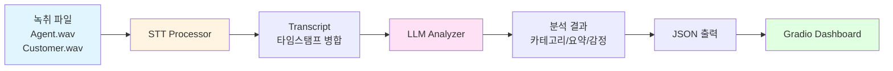
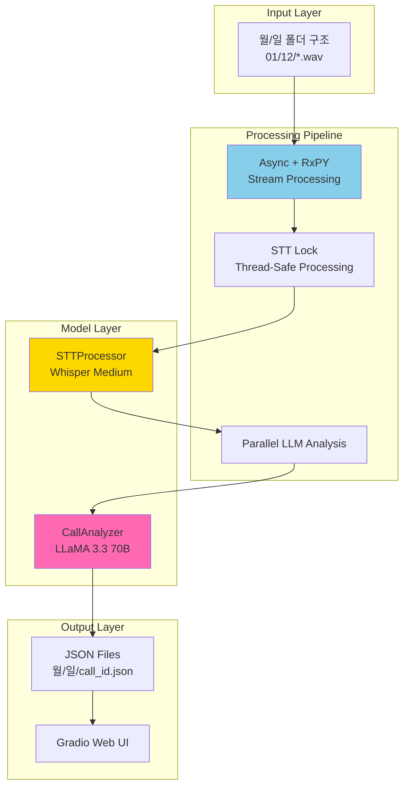
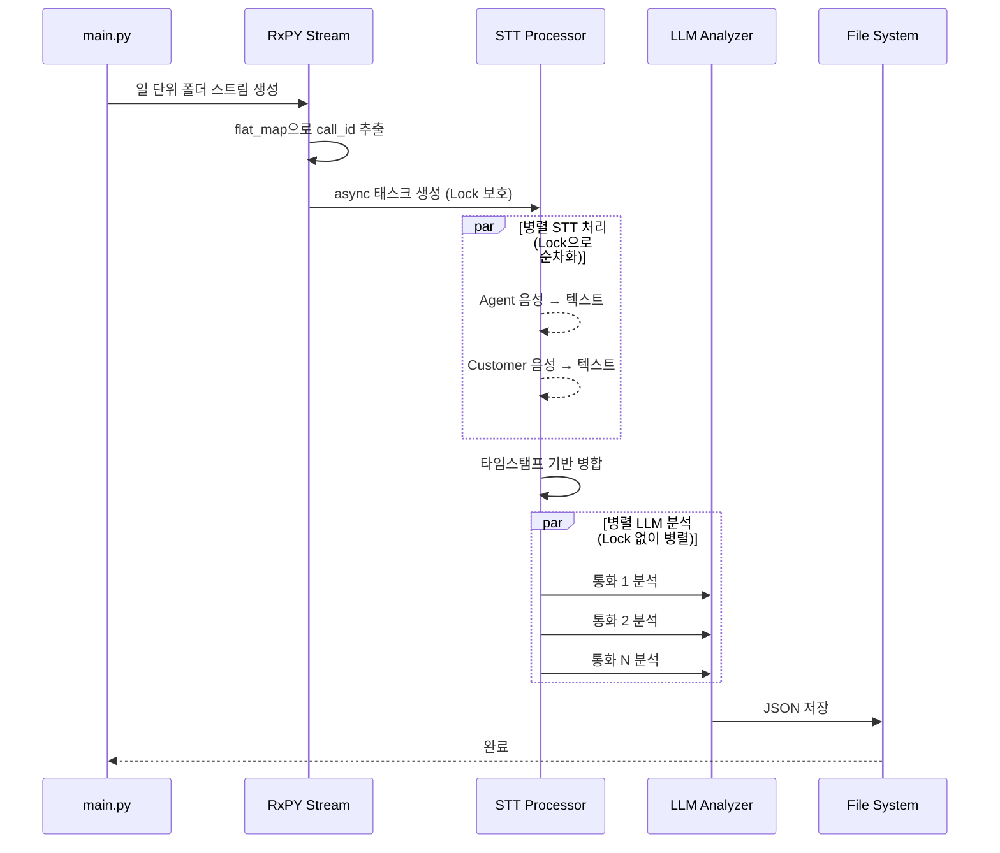

# Call-Tegorizer 🎯

콜센터 녹취 자동 분석 시스템 - STT와 LLM을 활용한 통화 내용 자동 분류 및 요약

## 📋 목차

- [프로젝트 개요](#프로젝트-개요)
- [시스템 아키텍처](#시스템-아키텍처)
- [주요 기능](#주요-기능)
- [기술 스택](#기술-스택)
- [설치 및 실행](#설치-및-실행)
- [STT REST API](#5-stt-rest-api-서버)
- [프로젝트 구조](#프로젝트-구조)
- [확장 가능성](#확장-가능성)
- [출력 데이터 구조](#출력-데이터-구조)

---

## 프로젝트 개요

Call-Tegorizer는 대용량 콜센터 녹취 파일을 자동으로 처리하여 텍스트 변환(STT), 내용 요약, 카테고리 분류를 수행하는 시스템입니다.

### 핵심 가치
- **자동화**: 수동 녹취록 작성 시간 95% 단축
- **인사이트**: 통화 카테고리, 감정, 해결 여부 자동 분석
- **확장성**: STT/LLM 모델 교체 가능한 모듈식 설계
- **병렬 처리**: Async + RxPY 기반 고성능 배치 처리

---

## 시스템 아키텍처

### 전체 데이터 플로우



### 시스템 컴포넌트 아키텍처



### 비동기 처리 플로우



---

## 주요 기능

### 1. STT (Speech-to-Text)
- **모델**: OpenAI Whisper (기본: medium)
- **화자 분리**: 상담사(RX) / 고객(TX) 별도 처리
- **타임스탬프 병합**: 시간순 대화 재구성
- **Thread-safe**: asyncio Lock으로 병렬 처리 안전성 보장

### 2. LLM 분석
- **모델**: LLaMA 3.3 70B (Ollama 로컬 실행)
- **분석 항목**:
  - 3줄 요약
  - 카테고리/세부 카테고리 자동 분류
  - 고객 의도 파악
  - 해결 여부 (해결됨/미해결/후속조치필요)
  - 감정 분석 (긍정/중립/부정)
  - 키워드 추출
  - 필요 후속 조치

### 3. 배치 처리
- **RxPY 스트림**: 함수형 리액티브 프로그래밍
- **비동기 병렬 처리**: asyncio.gather()
- **일 단위 자동 탐색**: 월/일 폴더 구조 재귀 탐색
- **단일 날짜 모드**: 특정 날짜만 처리 가능

### 4. 웹 대시보드 (Gradio)
- 통화 목록 조회
- 상세 분석 결과 시각화
- 카테고리별 통계 차트
- 감정 분석 분포도

---

## 기술 스택

### Core
- **Python 3.11+**
- **asyncio**: 비동기 I/O
- **RxPY**: 리액티브 프로그래밍

### AI/ML
- **OpenAI Whisper**: STT 모델
- **Ollama + LLaMA 3.3 70B**: LLM 분석
- **PyTorch**: 딥러닝 프레임워크

### Web UI
- **Gradio**: 웹 대시보드

### Data Processing
- **Pathlib**: 파일 시스템 처리
- **JSON**: 구조화된 데이터 저장

---

## 설치 및 실행

### 1. 환경 설정

```bash
# Python 가상환경 생성
python -m venv .venv
source .venv/bin/activate  # Windows: .venv\Scripts\activate

# 의존성 설치
pip install -r requirements.txt
```

### 2. Ollama 설정 (LLM)

```bash
# Ollama 설치 (https://ollama.ai)
curl -fsSL https://ollama.ai/install.sh | sh

# LLaMA 모델 다운로드
ollama pull llama3.3:70b

# Ollama 서버 실행 확인
ollama serve  # 기본 포트: 11434
```

### 3. 배치 처리 실행

```bash
# 전체 폴더 처리
python main.py --input_dir /path/to/sample_call --output_dir /path/to/output

# 특정 날짜만 처리
python main.py --input_dir /path/to/sample_call/01/12 --output_dir /path/to/output

# 기본값 사용 (main.py에 설정된 경로)
python main.py
```

### 4. Gradio 대시보드 실행

```bash
python dashboard.py

# 브라우저에서 자동 오픈: http://localhost:7860
```

### 5. STT REST API 서버

외부 시스템에서 STT 기능을 API로 호출할 수 있습니다.

#### 서버 실행
```bash
python stt_api.py
# 기본 포트: 8000
```

#### 서버 종료
```bash
pkill -f "stt_api"
```

#### API 엔드포인트

| 엔드포인트 | 메서드 | 설명 |
|-----------|--------|------|
| `/health` | GET | 서버 상태 확인 |
| `/models` | GET | 사용 가능한 모델 목록 |
| `/transcribe` | POST | 단일 파일 STT |
| `/transcribe_conversation` | POST | 2채널 대화 STT |
| `/docs` | GET | Swagger UI (API 문서) |

#### curl 사용 예시

```bash
# 상태 확인
curl http://localhost:8000/health

# 모델 목록
curl http://localhost:8000/models

# 단일 파일 STT (기본 모델)
curl -X POST "http://localhost:8000/transcribe" \
    -F "file=@audio.wav"

# 단일 파일 STT (모델 지정)
curl -X POST "http://localhost:8000/transcribe" \
    -F "file=@audio.wav" \
    -F "model=large-v3"

# 2채널 대화 STT
curl -X POST "http://localhost:8000/transcribe_conversation" \
    -F "agent_file=@call-RX.wav" \
    -F "customer_file=@call-TX.wav"

# 2채널 대화 STT (모델 지정)
curl -X POST "http://localhost:8000/transcribe_conversation" \
    -F "agent_file=@call-RX.wav" \
    -F "customer_file=@call-TX.wav" \
    -F "model=large-v3"
```

#### 지원 모델

| 모델 | 크기 | 속도 | 정확도 |
|------|------|------|--------|
| tiny | 39M | 가장 빠름 | 낮음 |
| base | 74M | 빠름 | 보통 |
| small | 244M | 보통 | 좋음 |
| medium | 769M | 느림 | 매우 좋음 |
| large-v2 | 1.5G | 가장 느림 | 우수 |
| large-v3 | 1.5G | 가장 느림 | 최고 |

---

## 프로젝트 구조

```
call-tegorizer/
├── main.py                 # 메인 배치 처리 스크립트
├── stt_api.py              # STT REST API 서버 (FastAPI)
├── stt_operator.py         # STT 처리 모듈 (Whisper)
├── llm_operator.py         # LLM 분석 모듈 (LLaMA)
├── dashboard.py            # Gradio 웹 대시보드
├── config.yaml             # 모델 설정 파일
├── categories.json         # 카테고리 정의
├── requirements.txt        # Python 의존성
├── README.md              # 프로젝트 문서
│
├── sample_call/           # 입력 데이터
│   ├── 01/               # 1월
│   │   ├── 12/          # 12일
│   │   │   ├── call-RX.wav  # 상담사 음성
│   │   │   └── call-TX.wav  # 고객 음성
│   │   └── 13/
│   └── output/           # 출력 데이터
│       └── 01/
│           └── 12/
│               └── call_id.json
│
└── .venv/                # Python 가상환경
```

### 파일명 규칙

**입력 파일**:
- `{call_id}-RX.wav`: 상담사 음성 (Receive)
- `{call_id}-TX.wav`: 고객 음성 (Transmit)
- call_id는 `-RX` 또는 `-TX` 이전까지의 문자열

**출력 파일**:
- `{call_id}.json`: 분석 결과 JSON

---

## 확장 가능성

### 1. STT 모델 교체

`config.yaml`에서 설정 변경:

```yaml
stt:
  provider: whisper  # 또는 google, azure, aws
  model_name: large-v3  # tiny, base, small, medium, large, large-v3
  language: ko
```

**지원 가능한 STT 엔진**:
- OpenAI Whisper (로컬)
- Google Cloud Speech-to-Text
- Azure Speech Services
- AWS Transcribe
- Naver Clova Speech

### 2. LLM 모델 교체

`config.yaml`에서 설정 변경:

```yaml
llm:
  provider: ollama  # 또는 openai, anthropic, azure
  base_url: http://localhost:11434
  model: llama3.3:70b  # 또는 gpt-4, claude-3.5-sonnet
  temperature: 0.7
```

**지원 가능한 LLM**:
- Ollama (로컬): LLaMA, Mistral, Gemma 등
- OpenAI: GPT-4, GPT-3.5
- Anthropic: Claude 3.5 Sonnet
- Azure OpenAI Service

### 3. 카테고리 커스터마이징

`categories.json` 수정:

```json
{
  "기술지원": ["설치문의", "오류해결", "사용방법"],
  "영업": ["견적요청", "계약문의", "제품소개"],
  "새로운카테고리": ["서브1", "서브2"]
}
```

---

## 출력 데이터 구조

### JSON 스키마

```json
{
  "call_id": "140142-IN-Q10009-...",
  "date": "01/12",
  "transcript": {
    "agent": {
      "file": "call-RX.wav",
      "text": "전체 상담사 발화 텍스트",
      "segments": [
        {
          "start": 0.0,
          "end": 5.2,
          "text": "안녕하세요..."
        }
      ]
    },
    "customer": {
      "file": "call-TX.wav",
      "text": "전체 고객 발화 텍스트",
      "segments": [...]
    },
    "merged": [
      {
        "speaker": "상담사",
        "start": 0.0,
        "end": 5.2,
        "text": "안녕하세요..."
      },
      {
        "speaker": "고객",
        "start": 5.5,
        "end": 10.3,
        "text": "네 안녕하세요..."
      }
    ]
  },
  "analysis": {
    "summary": "3줄 요약 내용",
    "category": "주문/결제",
    "sub_category": "주문취소",
    "customer_intent": "고객의 주요 의도",
    "resolution": "해결됨",
    "sentiment": "긍정",
    "keywords": ["주문", "취소", "환불"],
    "action_required": null
  }
}
```

---

## 성능 지표

### 처리 속도 (예상)
- **STT**: ~1분 녹취 → 10초 처리 (Whisper medium, GPU)
- **LLM**: ~500토큰 분석 → 5초 처리 (LLaMA 70B, GPU)
- **전체**: 1통화 평균 15-20초

### 병렬 처리
- **STT**: Lock으로 순차 처리 (Whisper 멀티스레드 이슈)
- **LLM**: 병렬 처리 가능 (Ollama 동시 요청 지원)
- **최적화**: 통화 100개 → 약 30분 (순차: 2.5시간)

---

## 라이선스

MIT License

---

## 개발자

**Project**: Call-Tegorizer MVP
**Tech Stack**: Python, Whisper, LLaMA, RxPY, Gradio
**Architecture**: Async Pipeline with Reactive Streams
